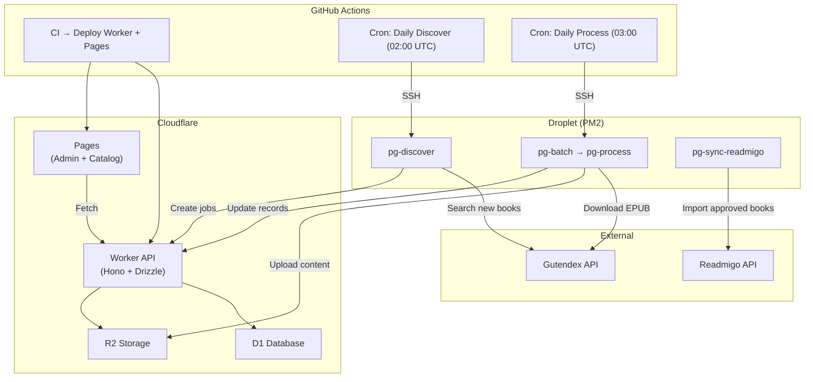
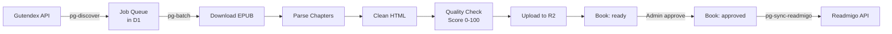
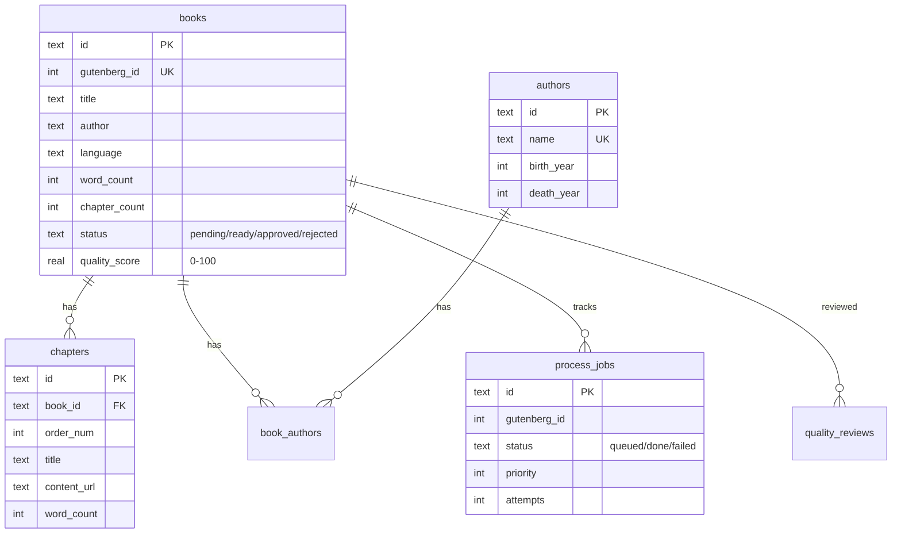

# Gutenberg Platform

Content acquisition and processing platform for public domain books from [Project Gutenberg](https://www.gutenberg.org/). Serves as the book content pipeline for [Readmigo](https://readmigo.com) — covering discovery, EPUB parsing, quality control, and API syndication.

## Architecture



## Tech Stack

| Component | Technology | Role |
|-----------|-----------|------|
| API | Cloudflare Worker + Hono | REST API, Cron triggers |
| Database | Cloudflare D1 + Drizzle ORM | Book metadata, chapters, jobs |
| Storage | Cloudflare R2 | EPUB files, covers, chapter HTML |
| Frontend | Cloudflare Pages | Admin dashboard + public catalog |
| Processing | Node.js + PM2 on Droplet | EPUB download, parse, clean |
| CI/CD | GitHub Actions | Auto-deploy + scheduled tasks |

## Project Structure

```
gutenberg/
├── worker/              # Cloudflare Worker API
│   └── src/
│       ├── index.ts           # App entry (Hono + Cron + Queue)
│       ├── routes/
│       │   ├── public.ts      # /books, /authors, /stats, /content/*
│       │   ├── admin.ts       # /admin/* (token-protected)
│       │   └── internal.ts    # /internal/* (key-protected)
│       ├── db/schema.ts       # Drizzle schema
│       ├── middleware/auth.ts  # Auth middleware
│       └── services/discover.ts
├── scripts/             # Droplet processing scripts
│   ├── pg-discover.ts         # Find new books from Gutendex
│   ├── pg-batch.ts            # Batch process queued jobs
│   ├── pg-process.ts          # Single book: download → parse → upload
│   ├── pg-quality-report.ts   # Quality audit report
│   ├── pg-sync-readmigo.ts    # Sync approved books to Readmigo
│   └── lib/
│       ├── epub-parser.ts     # EPUB → chapters extraction
│       ├── content-cleaner.ts # HTML cleaning & normalization
│       ├── quality-checker.ts # Quality scoring (0-100)
│       ├── gutendex-client.ts # Gutendex API client
│       ├── worker-client.ts   # Worker API client
│       ├── r2-client.ts       # R2 upload via Worker
│       └── process-book.ts    # End-to-end book processing
├── web/                 # Cloudflare Pages frontend
│   └── src/
│       ├── index.html         # Public book catalog
│       ├── book.html          # Book detail + chapter list
│       ├── chapter.html       # Chapter reader
│       └── admin.html         # Admin dashboard
└── .github/workflows/
    ├── ci.yml                 # Lint + type check
    ├── deploy-worker.yml      # Auto-deploy Worker on push
    ├── deploy-web.yml         # Auto-deploy Pages on push
    ├── daily-discover.yml     # Cron: discover new books
    ├── daily-process.yml      # Cron: process queued books
    └── manual-trigger.yml     # Manual workflow dispatch
```

## API Endpoints

### Public (no auth)

| Method | Path | Description |
|--------|------|-------------|
| GET | `/books` | Paginated book list (query: `page`, `limit`, `search`, `language`, `status`) |
| GET | `/books/:id` | Book detail with author info |
| GET | `/books/:id/chapters` | Chapter list for a book |
| GET | `/books/:id/chapters/:cid` | Single chapter content |
| GET | `/authors` | Paginated author list (query: `search`) |
| GET | `/authors/:id` | Author detail with books |
| GET | `/stats` | Aggregate counts (total, by status, by language) |
| GET | `/content/*` | Serve R2-stored content (covers, chapter HTML) |

### Admin (Bearer token)

| Method | Path | Description |
|--------|------|-------------|
| POST | `/admin/discover` | Trigger book discovery |
| POST | `/admin/process/:gutenbergId` | Trigger single book processing |
| GET | `/admin/jobs` | Job queue list (query: `status`, `page`, `limit`) |
| GET | `/admin/jobs/:id` | Job detail |
| POST | `/admin/books/:id/approve` | Approve a book for Readmigo |
| POST | `/admin/books/:id/reject` | Reject a book (requires `notes`) |
| POST | `/admin/books/:id/sync` | Sync approved book to Readmigo |

### Internal (API key)

| Method | Path | Description |
|--------|------|-------------|
| POST | `/internal/books` | Create book record |
| PUT | `/internal/books/:id` | Update book fields |
| POST | `/internal/books/:id/chapters` | Batch create chapters |
| GET | `/internal/books/exists` | Check existing books by Gutenberg IDs |
| POST | `/internal/jobs` | Create processing job |
| GET | `/internal/jobs` | Pull queued jobs |
| PUT | `/internal/jobs/:id` | Update job status |
| PUT | `/internal/r2/*` | Upload file to R2 |

## Processing Pipeline



## GitHub Actions

| Workflow | Trigger | What it does |
|----------|---------|-------------|
| **CI** | Push / PR | Lint + type check |
| **Deploy Worker** | CI passes on `main` | `wrangler deploy` |
| **Deploy Web** | Push to `main` | Deploy Pages |
| **Daily Discover** | Cron 02:00 UTC | SSH → `pg-discover.ts` (50 books, min 100 downloads) |
| **Daily Process** | Cron 03:00 UTC | SSH → `pg-batch.ts` (default 10 books) |
| **Manual Trigger** | Manual dispatch | Ad-hoc script execution |

## Database Schema



## Development

### Prerequisites

- Node.js 20+
- pnpm 9+
- Cloudflare account (Wrangler CLI)

### Local Development

```bash
pnpm install

# Start Worker locally
pnpm dev:worker

# Database migrations
pnpm db:generate
pnpm db:migrate:local   # local D1
pnpm db:migrate:remote  # production D1
```

### Deployment

Push to `main` triggers automatic deployment via GitHub Actions. No manual deployment needed.

## Content Source

All book content is sourced from [Project Gutenberg](https://www.gutenberg.org/) and is in the **public domain**. Metadata is retrieved via the [Gutendex API](https://gutendex.com/).
