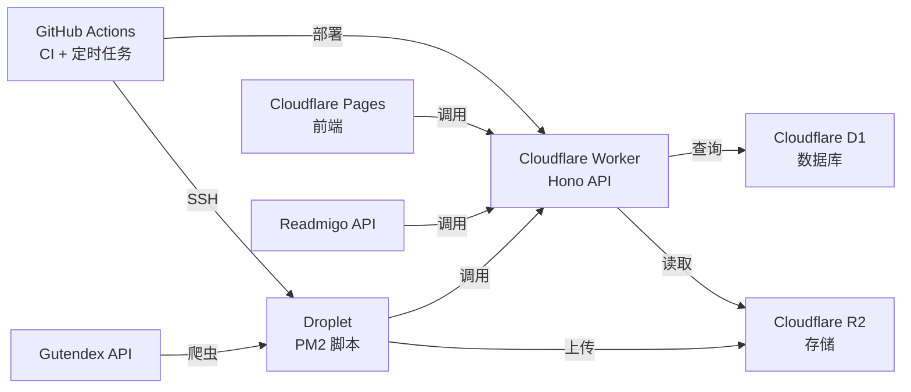

# Gutenberg — 古登堡公版书内容平台

Readmigo 的独立微服务，负责从 Project Gutenberg 采集、处理、管理公版图书。提供书籍目录 API、管理后台、Web 前端，为 Readmigo 应用供应超过 10 万册免费电子书内容。

## 角色定位

Gutenberg 平台是 Readmigo 内容供应链的核心。它独立部署在 Cloudflare 基础设施上，通过 REST API 向 Readmigo 应用同步审核通过的书籍。与其他子项目形成单向依赖：其他项目调用其 API，但不被其他项目依赖。

## 技术栈

- **Worker API**: Cloudflare Worker + Hono + Drizzle ORM
- **数据库**: Cloudflare D1（SQLite）
- **存储**: Cloudflare R2（EPUB、封面、章节 HTML）
- **前端**: Cloudflare Pages（静态 HTML）
- **脚本**: Node.js + PM2（Droplet 上运行）
- **包管理**: pnpm
- **CI/CD**: GitHub Actions

## 架构


```mermaid
graph LR
    A["GitHub Actions<br/>CI + 定时任务"] -->|部署| B["Cloudflare Worker<br/>Hono API"]
    A -->|SSH| C["Droplet<br/>PM2 脚本"]
    D["Gutendex API"] -->|爬虫| C
    C -->|调用| B
    C -->|上传| E["Cloudflare R2<br/>存储"]
    B -->|查询| F["Cloudflare D1<br/>数据库"]
    B -->|读取| E
    G["Cloudflare Pages<br/>前端"] -->|调用| B
    H["Readmigo API"] -->|调用| B
```

## 目录结构

- `worker/` — Cloudflare Worker（Hono REST API + Drizzle 数据库）
  - `src/index.ts` — 应用入口（路由、Cron、队列）
  - `src/routes/` — 路由处理（public、admin、internal）
  - `src/db/schema.ts` — 数据库模式（Drizzle）
  - `src/services/` — 业务逻辑
  - `src/middleware/auth.ts` — 认证中间件
- `scripts/` — Droplet 长运行脚本（Node.js）
  - `pg-discover.ts` — 从 Gutendex 发现新书
  - `pg-batch.ts` — 批量处理队列中的任务
  - `pg-process.ts` — 单本处理：下载 → 解析 → 上传
  - `pg-quality-report.ts` — 质量审计报告
  - `pg-sync-readmigo.ts` — 同步已审核图书到 Readmigo
  - `lib/` — 共享库（EPUB 解析、清理、质检等）
- `web/` — Cloudflare Pages 前端（静态 HTML）
  - `src/index.html` — 公开书籍目录
  - `src/book.html` — 书籍详情 + 章节列表
  - `src/chapter.html` — 章节阅读器
  - `src/admin.html` — 管理后台
- `.github/workflows/` — CI/CD 工作流

## 本地开发

### 环境要求

- Node.js 20+
- pnpm 9+
- Cloudflare 账户（Wrangler CLI）

### 安装与运行

```bash
# 安装依赖
pnpm install

# 启动 Worker 本地环境
pnpm dev:worker

# 访问 http://localhost:8787

# 数据库操作
pnpm db:generate      # 生成 Drizzle 类型
pnpm db:migrate:local  # 本地 D1 迁移
pnpm db:migrate:remote # 生产 D1 迁移（谨慎！）
```

## 部署

| 组件 | 平台 | 触发 | 命令 |
|------|------|------|------|
| Worker API | Cloudflare | push to main | `wrangler deploy` |
| Pages 前端 | Cloudflare | push to main | 自动部署 |
| Droplet 脚本 | PM2 | GitHub Actions SSH | `pg-discover.ts` 等 |

GitHub Actions 工作流在 `main` 分支检测到更新后，自动运行 CI（lint、type check）、部署 Worker 和 Pages。Cron 任务分别在 UTC 02:00（发现新书）和 03:00（处理任务）触发。

## 环境变量

REQUIRED（.env）：

- `CLOUDFLARE_API_TOKEN` — Wrangler 认证
- `CLOUDFLARE_ACCOUNT_ID` — Cloudflare 账户 ID
- `CLOUDFLARE_DATABASE_ID` — D1 数据库 ID
- `CLOUDFLARE_R2_BUCKET` — R2 bucket 名称
- `GUTENDEX_API_URL` — Gutendex API 地址（http://gutendex.com）
- `READMIGO_API_URL` — Readmigo 后端 URL
- `READMIGO_API_KEY` — Readmigo API 认证密钥

## 相关 Repo

- **api** — Readmigo 后端（调用 Gutenberg API）
- **web** — Web 应用（展示来自 Gutenberg 的图书）
- **ios** — iOS 应用（展示来自 Gutenberg 的图书）
- **android** — Android 应用（展示来自 Gutenberg 的图书）

## 文档

- 📚 在线文档: https://docs.readmigo.app
- 📋 架构设计: https://docs.readmigo.app/plans/2026-02-17-gutenberg-platform-design
