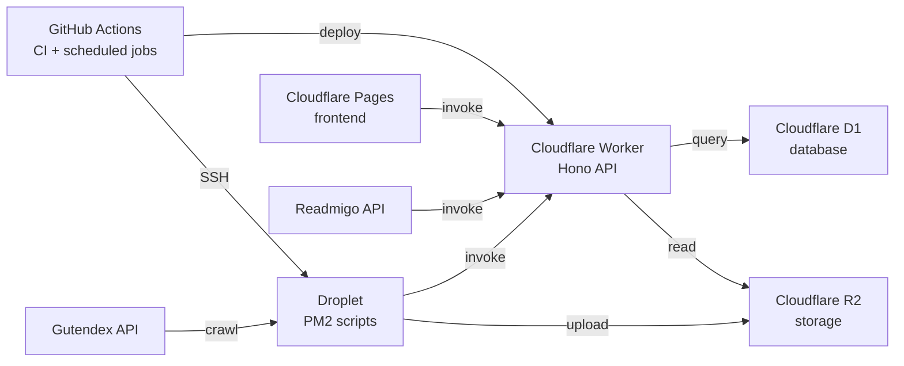

# Gutenberg — Public Domain Book Content Platform

A standalone Readmigo microservice that ingests, processes, and manages public-domain books from Project Gutenberg. It exposes a book catalog API, an admin console, and a public web frontend, supplying more than 100,000 free e-book titles to the Readmigo applications.

## Role

The Gutenberg platform is at the core of Readmigo's content supply chain. It is deployed independently on Cloudflare infrastructure and syncs approved books to the Readmigo apps via a REST API. It forms a one-way dependency with the other sub-projects: they call its API, but it depends on none of them.

## Tech Stack

- **Worker API**: Cloudflare Worker + Hono + Drizzle ORM
- **Database**: Cloudflare D1 (SQLite)
- **Storage**: Cloudflare R2 (EPUB, covers, chapter HTML)
- **Frontend**: Cloudflare Pages (static HTML)
- **Scripts**: Node.js + PM2 (running on the Droplet)
- **Package Manager**: pnpm
- **CI/CD**: GitHub Actions

## Architecture


```mermaid
graph LR
    A["GitHub Actions<br/>CI + scheduled jobs"] -->|deploy| B["Cloudflare Worker<br/>Hono API"]
    A -->|SSH| C["Droplet<br/>PM2 scripts"]
    D["Gutendex API"] -->|crawl| C
    C -->|invoke| B
    C -->|upload| E["Cloudflare R2<br/>storage"]
    B -->|query| F["Cloudflare D1<br/>database"]
    B -->|read| E
    G["Cloudflare Pages<br/>frontend"] -->|invoke| B
    H["Readmigo API"] -->|invoke| B
```

## Directory Structure

- `worker/` — Cloudflare Worker (Hono REST API + Drizzle database)
  - `src/index.ts` — Application entry (routes, Cron, queues)
  - `src/routes/` — Route handlers (public, admin, internal)
  - `src/db/schema.ts` — Database schema (Drizzle)
  - `src/services/` — Business logic
  - `src/middleware/auth.ts` — Authentication middleware
- `scripts/` — Long-running scripts on the Droplet (Node.js)
  - `pg-discover.ts` — Discover new books from Gutendex
  - `pg-batch.ts` — Batch process queued tasks
  - `pg-process.ts` — Single-book processing: download → parse → upload
  - `pg-quality-report.ts` — Quality audit report
  - `pg-sync-readmigo.ts` — Sync approved books to Readmigo
  - `lib/` — Shared libraries (EPUB parsing, sanitization, QA, etc.)
- `web/` — Cloudflare Pages frontend (static HTML)
  - `src/index.html` — Public book catalog
  - `src/book.html` — Book detail + chapter list
  - `src/chapter.html` — Chapter reader
  - `src/admin.html` — Admin console
- `.github/workflows/` — CI/CD workflows

## Local Development

### Requirements

- Node.js 20+
- pnpm 9+
- Cloudflare account (Wrangler CLI)

### Install and Run

```bash
# Install dependencies
pnpm install

# Start the Worker locally
pnpm dev:worker

# Open http://localhost:8787

# Database operations
pnpm db:generate      # Generate Drizzle types
pnpm db:migrate:local  # Local D1 migration
pnpm db:migrate:remote # Production D1 migration (handle with care!)
```

## Deployment

| Component | Platform | Trigger | Command |
|------|------|------|------|
| Worker API | Cloudflare | push to main | `wrangler deploy` |
| Pages frontend | Cloudflare | push to main | Auto-deploy |
| Droplet scripts | PM2 | GitHub Actions SSH | `pg-discover.ts`, etc. |

When the `main` branch is updated, the GitHub Actions workflow runs CI (lint, type check) and deploys both the Worker and Pages. Cron jobs trigger at UTC 02:00 (discover new books) and 03:00 (process tasks).

## Environment Variables

REQUIRED (.env):

- `CLOUDFLARE_API_TOKEN` — Wrangler authentication
- `CLOUDFLARE_ACCOUNT_ID` — Cloudflare account ID
- `CLOUDFLARE_DATABASE_ID` — D1 database ID
- `CLOUDFLARE_R2_BUCKET` — R2 bucket name
- `GUTENDEX_API_URL` — Gutendex API URL (http://gutendex.com)
- `READMIGO_API_URL` — Readmigo backend URL
- `READMIGO_API_KEY` — Readmigo API authentication key

## Related Repos

- **api** — Readmigo backend (calls the Gutenberg API)
- **web** — Web app (displays books from Gutenberg)
- **ios** — iOS app (displays books from Gutenberg)
- **android** — Android app (displays books from Gutenberg)

## Documentation

- Online docs: https://docs.readmigo.app
- Architecture design: https://docs.readmigo.app/plans/2026-02-17-gutenberg-platform-design
